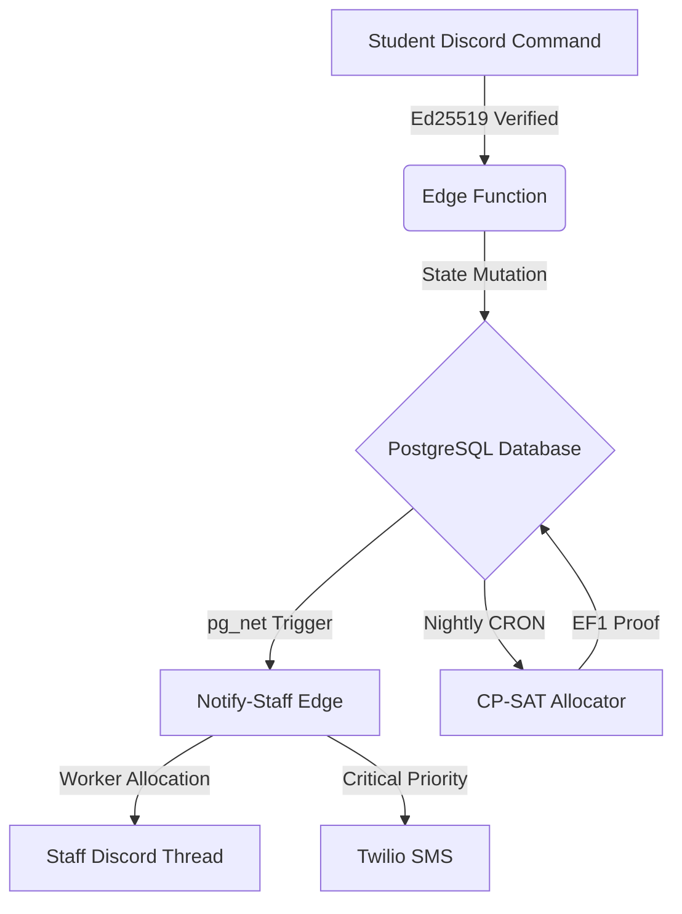

# AHCMS: An Autonomous, Mathematically Rigorous Management System

Traditional hostel and facilities management systems operate as passive CRUD applications. They store data, present forms, and wait for human operators to resolve state. This architecture fundamentally fails to scale under high-variance load, leading to SLA breaches, sub-optimal resource allocation, and systemic friction.

The **AHCMS Sovereign System** reconstructs this domain from first principles. We shift from a passive data-store model to an **active, mathematically constrained sovereign agent**. The system does not merely record complaints and room assignments; it actively computes the globally optimal resolution graph, enforces constraints mathematically, and pushes state mutations to humans via peripheral channels (Discord, SMS).

## The Core Philosophy

1. **Mathematical Optimality over Heuristics**: Resource allocation (rooms, staff assignment) is framed as a Constraint Satisfaction Problem (CSP). We discard greedy heuristics in favor of Constraint Programming (CP-SAT) to mathematically guarantee Max-Min Fairness and Envy-Freeness (EF1).
2. **Autonomous Triage via Evolutionary Algorithms**: Human perception of "severity" is noisy. The system employs a Genetic Algorithm (GA) to evolve weights across historical data, autonomously prioritizing complaints based on multi-dimensional tensors (severity, SLA proximity, block distance, worker load).
3. **Peripheral Human Interfaces**: The core system is headless. Humans interact with it via their existing attention-centers (Discord). The system utilizes Edge Functions and PostgreSQL Triggers to push state changes to Discord threads and Twilio SMS, entirely bypassing the need for staff to "poll" a dashboard.

## Table of Contents

- [System Architecture](architecture.md)
- [Algorithmic Foundations (CP-SAT & Genetic Algorithms)](algorithms.md)
- [Relational State & Trigger Hooks](database.md)

## System State Machine

At a high level, the system can be modeled as a state machine where transitions are guarded by cryptographic verification and constrained by operational SLAs.

## Engineering Stack

- **Core State Engine**: PostgreSQL (Supabase), leveraging `pgcrypto` for UUIDs and `pg_net` for asynchronous webhook triggers.
- **Compute (Edge)**: Deno V8 Isolates. Chosen for cold-start characteristics (<10ms) required by Discord's stringent 3-second interaction webhook SLA.
- **Compute (Heavy)**: Python with OR-Tools (C++ backend) for solving NP-hard allocation matrices.
- **Front-End**: Next.js (React) operating strictly as a read-replica viewer of the state, utilizing Server Components for zero-bundle payload where interactivity is not required.
